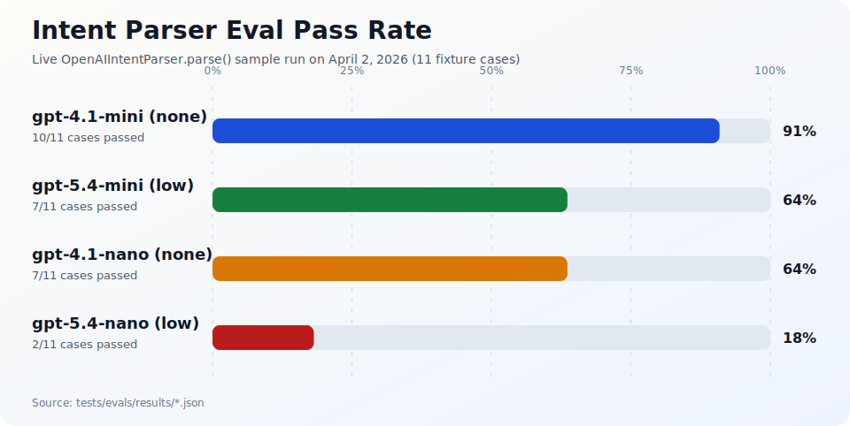

# FRED Query

`fred-query` is a Python app for asking plain-English questions about FRED data and turning them into structured queries, charts, and summaries.


This repo includes:

- a FastAPI backend
- a small browser UI served by that backend
- a CLI
- a typed service layer that executes FRED lookups deterministically

The LLM is only used for intent parsing and clarification. Data retrieval, transforms, and chart generation happen in code.

## What It Does

Examples of the kinds of questions it handles:

- "Show me the unemployment rate since 2020"
- "Compare CPI and PCE since 2019"
- "Rank the top 10 states by unemployment rate"
- "How has California GDP compared with Texas since 2019?"
- "What was the first release value for this series?"

Today the main supported flows are:

- single-series lookups
- pairwise comparisons and relationship analysis
- cross-sectional rankings
- state GDP comparison
- follow-up queries on the API via `session_id`
- vintage / revision analysis for first-release vs latest values

## Quick Start

Requirements:

- Python 3.12+
- a [FRED API key](https://fred.stlouisfed.org/docs/api/api_key.html)
- an [OpenAI API key](https://platform.openai.com/api-keys) for natural-language parsing

Install:

```bash
python -m venv .venv
source .venv/bin/activate
# Windows PowerShell: .\.venv\Scripts\Activate.ps1

pip install -U pip
pip install -e .
```

Create a `.env` file:

```env
FRED_API_KEY=...
OPENAI_API_KEY=...
OPENAI_MODEL=gpt-5.4-mini
OPENAI_REASONING_EFFORT=low
```

Run the app:

```bash
uvicorn fred_query.api.app:app --reload
```

Then open `http://127.0.0.1:8000`.

## CLI

The package installs a `fred-query` command.

Examples:

```bash
fred-query ask "Show me the unemployment rate since 2020"
fred-query ask "Compare CPI and PCE since 2019" --format json
fred-query compare-state-gdp --state1 CA --state2 TX --start-date 2019-01-01
```

You can also write the generated chart spec to disk with `--chart-spec-out`.

## Evals

`tests/evals/` is a small live eval harness for the intent parser. It is useful when you are changing prompts, parser behavior, or model settings and want a quick quality check on real OpenAI calls.

These evals are skipped during normal test runs unless you opt in:

```bash
python -m pytest tests/evals/test_intent_evals.py --run-evals -q
python -m pytest tests/evals/test_intent_evals.py --run-evals -q --eval-model gpt-5.4-mini
python -m pytest tests/evals/test_intent_evals.py --run-evals -q --eval-results-out tests/evals/results/gpt-5.4-mini.json
python -m pytest tests/evals/test_clarification_trigger_evals.py --run-evals -q --eval-model gpt-5.4-mini
python -m pytest tests/test_clarification_resolver_eval_cases.py -q
```

The evals now split into three layers:

- `test_intent_evals.py`: broad parser behavior
- `test_clarification_trigger_evals.py`: parser-side clarification triggering
- `test_clarification_resolver_eval_cases.py`: fixture-driven resolver ranking/labeling/dedup behavior

The live eval harness prints a scorecard in the test output, and it can write JSON snapshots for model-to-model comparisons. When `--eval-results-out` is set, the general intent suite writes the requested file and the clarification-trigger suite writes a sibling file with `-clarification-trigger` appended to the filename. The chart below is generated from saved intent-eval results:



## What To Know About This Repo

- `src/fred_query/services/` is the core of the project. That is where intent routing, FRED lookups, transforms, and analysis live.
- `src/fred_query/api/` contains the FastAPI app and the static browser UI.
- `tests/` is mostly unit coverage for routing, transforms, API behavior, and clarification logic.
- `/api/ask` supports follow-up questions. The response includes a `session_id`; send it back on the next request to support prompts like "now make that YoY" or "rank the top 5 instead."
- Ambiguous prompts are expected. The app can return candidate series so the caller can disambiguate instead of guessing.

## Docker

```bash
docker compose up --build
```
